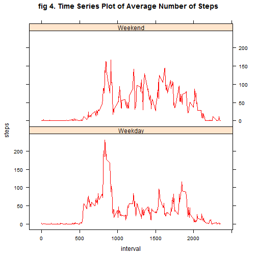

# Assignment 1 - Activity Monitoring Data
========================================================

Script:PA1_template.Rmd was compiled and tested on a PC using R Version 0.98.501.
Authored by Sarah Sayed

This document was created as an assignment for the [reproducible research](https://www.coursera.org/course/repdata) Coursera course.

This script evaluates activity data collected at 5 minute intervals through out the day by an anonymous individual collected during the months of October and November in 2012. 

 
## Part 1 - Ommiting missing values (no NAs)

Unzip and read the 'activity.csv' data file

```r
temp <- tempfile()
download.file("http://d396qusza40orc.cloudfront.net/repdata%2Fdata%2Factivity.zip",temp)
activityData <- read.csv(unz(temp, "activity.csv"))
unlink(temp)
head(activityData,3) ## Dataset contains NAs
```

```
##   steps       date interval
## 1    NA 2012-10-01        0
## 2    NA 2012-10-01        5
## 3    NA 2012-10-01       10
```
As shown above, missing values in the dataset are coded as NA.

Rename variables and assign attributes to data vectors

```r
colnames(activityData) = c("steps", "date", "interval")
activityData$date <- as.Date(activityData[ ,2])
```

# Mean Total Number of Steps Taken per Day
Melt the ActivityData dataset and cast the dataset to determine to the total steps taken per day, one value per date. Note that the activityMelt and sumSteps dataset include missing values. Compute the mean and median of the total number of steps taken per day for all days, omitting  NAs (missing values)

```r
library(reshape2) ## load reshaping package into R for melt and cast

activityMelt <- melt(activityData, id=c("date","interval"), measure.vars="steps")
sumSteps <- dcast(activityMelt, date ~ variable, sum)
overallMeanSteps <- mean(sumSteps[,2], na.rm = TRUE) #10766.19
overallMedianSteps <- median(sumSteps[,2], na.rm = TRUE) #10765
```
the mean of total steps is 10766.19 and the median steps taken is 10765.

Generating again the sum of steps database, this time ensuring it containing no NAs for the histogram plot. The aggregate() function was used to compute the total number of steps for each day, omitting all missing data points. 

```r
final <- aggregate(steps ~ date, activityData, sum)
```

The histogram of the sumSteps variable corresponding to the total number of steps taken with no NAs was plotted using the final dataset above.

```r
library(ggplot2) ## load graphical pacakage

g <- ggplot(final, aes(x=steps))  + geom_histogram(aes(y = ..count..), colour="white", fill = "darkmagenta") 
p <- g  + xlab("Sum of Steps") + ylab("Count") + ggtitle(expression("Fig 1. Total Number of Steps per Day")) 
print(p) ## print the resulting plot
```

```
## stat_bin: binwidth defaulted to range/30. Use 'binwidth = x' to adjust this.
```

 


# Average Daily Activity Pattern per 5-minute Interval
Compute the mean steps for each 5-minute interval  

```r
library(plyr) ##load the plyr package to use ddply function
intervalMean <- ddply(activityData,.(interval), summarize, 
                      meanSteps = mean(steps, na.rm =TRUE))
```

Generate a time series line plot of the interval vs. mean of steps using the ggplot function.

```r
h <- ggplot(intervalMean, aes(x = interval, y = meanSteps)) 
q <- h  + xlab("5 min Intervals") + ylab("Mean Steps") + ggtitle(" fig 2. Mean of steps taken per interval for all days") + geom_line(color = "darkblue") 
print(q) ## print the resulting plot
```

 

Determine the 5-minute interval in the intervalMean dataset corresponding to the maximum mean

```r
max(intervalMean$meanSteps)
```

```
## [1] 206.2
```

```r
intervalMean[intervalMean$meanSteps == max(intervalMean$meanSteps),]
```

```
##     interval meanSteps
## 104      835     206.2
```
the maximum mean Steps is 206.2, it occurs at interval label 835. 

#Part 2 Imputing Missing Values

Calculate the total number of NAs in dataset

```r
num_NA <- length(which(is.na(activityData$steps))) ## 2304
```

Set the interval variable in the activityData dataset into a factor object

```r
activityData$interval <- factor(activityData$interval)
```

Replace NAs in the activityData dataset with the meanSteps for a given interval.

```r
missing_steps <- which(is.na(activityData$steps))
interval_final <- activityData[missing_steps,  "interval"]
activityData[missing_steps,  "steps"]  <-  intervalMean[interval_final, "meanSteps"]
head(activityData,3) ## Note that the NAs have been replaced with the interval mean
```

```
##    steps       date interval
## 1 1.7170 2012-10-01        0
## 2 0.3396 2012-10-01        5
## 3 0.1321 2012-10-01       10
```

Plot the countSteps histogram, interval vs. Sumsteps, the new activityData dataset has the missing values replaced. Use the same procedure as above to generate the histogram containing no NAs.(this time the activityData dataset contains no missing values)

```r
activityMelt <- melt(activityData, id=c("date","interval"), measure.vars="steps")
sumSteps <- dcast(activityMelt, date ~ variable, sum)
g <- ggplot(sumSteps, aes(x=steps)) + geom_histogram(aes(y = ..count..), fill = "dark red", colour="white") 
p <- g  + xlab("Sum of Steps") +ylab("Count") + ggtitle(expression("fig 3.Total number of Steps taken per day (No NAs)")) 
print(p) ## print the resulting plot
```

```
## stat_bin: binwidth defaulted to range/30. Use 'binwidth = x' to adjust this.
```

 

In comparing the figure above to figure 1, it can be noted that although the two histograms are similar, the total number of steps has reduced when the NAs are replaced.

Compute the mean and median total number of steps taken per day for all days

```r
overallMeanSteps <- mean(sumSteps[,2]) #10766.19
overallMedianSteps <- median(sumSteps[,2]) # 10766.19 (vs. 10765 witn NAs)
```
In this case there is no difference with the mean, and a slight difference with the overall median of 10766.19 when the previous value was 10765.

# Differences in Activity Patterns between Weekdays and Weekends
Add a column to the activityData dataset corresponding the day of the week. The as.POSIXlt() function was used to convert the date variable into a date-time class object for the weekdays() function. This generates a character vector naming the corresponding day of the week as a string character.

```r
activityData$weekday <- as.factor(weekdays(as.POSIXlt(activityData$date, format='%Y/%m/%d')))
```

Use gsub function to replace the Monday to Friday characters with "Weekday".

```r
activityData$weekday <- gsub("Monday", "Weekday", activityData$weekday)
activityData$weekday <- gsub("Tuesday", "Weekday", activityData$weekday)
activityData$weekday <- gsub("Wednesday", "Weekday", activityData$weekday)
activityData$weekday <- gsub("Thursday", "Weekday", activityData$weekday)
activityData$weekday <- gsub("Friday", "Weekday", activityData$weekday)
```

Similarly, use gsub() to replace  and Sunday characters to "Weekend""

```r
activityData$weekday <- gsub("Saturday", "Weekend", activityData$weekday)
activityData$weekday <- gsub("Sunday", "Weekend", activityData$weekday)
```


Melt and cast the activityData dataset to compute the mean steps for each interval at the weekday/weekend. Subset the dataset according to weekday vs weekend. 

```r
weekActivityMelt <- melt(activityData, id=c("date","interval","weekday"), 
                     measure.vars="steps") 
weekActivity <- dcast(weekActivityMelt, interval + weekday ~ variable, mean)
weekendData <- subset(activityData, activityData$weekday == "Weekend")
```

The following code outline the construction of a panel plot using the lattice plotting system. This generates a graph containing a time series plot of the 5-minute interval and the average number of steps taken, averaged across all weekday days or weekend days.

Convert the factor value to numeric so that the x-axis scale on the lattice plot can be modified.

```r
weekActivity$interval <- as.numeric(levels(weekActivity$interval))[weekActivity$interval]
```

calculate position and create labels for plot

```r
x.tick.number <- 6
at <- seq(0, 2500, length.out=x.tick.number)
labels <- seq(0, 2500, length.out=x.tick.number)
```

Generate the plot with the values above, modifying the x-axis scale for clarity

```r
library(datasets)
library(lattice) ## load the lattice graphical package 
xyplot(steps ~ interval | weekday, data = weekActivity, scales=list(steps = (tick.number= 5), interval=list(at=at, labels = labels)), main="fig 4. Time Series Plot of Average Number of Steps",layout = c(1, 2), col= "red", type = "l")
```

 

Overall more steps were taken on the weekend (although at the earlier intervals more walking was done at the weekdays until interval label 800).
